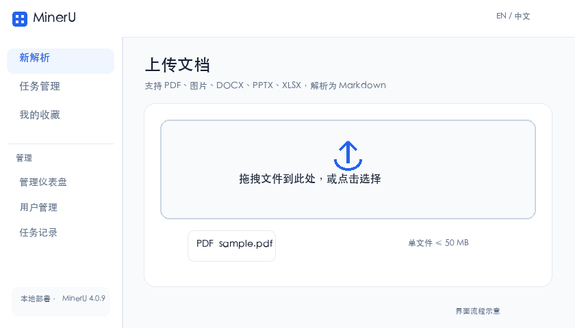

# MinerU Enterprise

**English** | [简体中文](README.zh-CN.md)

A self-hosted document processing application built around the [MinerU](https://github.com/opendatalab/MinerU) parser. It adds user accounts, asynchronous jobs, object storage, and an administration UI for teams that need to manage their own documents and results. This is an independent community project, not an official MinerU repository.



> The GIF illustrates the current UI flow with a fictional file. It is not a recording of a real document or a performance benchmark.

## What this repository provides

- **Parsing jobs:** Upload PDFs, common images, and Office files; create jobs in batches; track, cancel, retry, preview, and download results. Celery and Redis run the queue.
- **MinerU runtime:** CPU and GPU worker dependencies are pinned to **MinerU 4.0.10**. The backend accepts `flash`, `basic`, `standard`, and `advanced`, plus legacy names such as `pipeline`, `hybrid`, and `vlm`.
- **Review UI:** The Next.js task detail page shows the source document beside the Markdown result. The admin UI provides job history and statistics.
- **Identity and storage:** Local accounts, optional OIDC/LDAP/WeCom/DingTalk sign-in, and presigned uploads to S3-compatible storage such as MinIO.
- **Deployment:** Docker Compose runs Next.js, FastAPI, PostgreSQL, Redis, MinIO, Nginx, and the workers. An NVIDIA GPU profile is available.

## Comparison with upstream MinerU

“Upstream” here means the [open-source MinerU 4.0.10 repository](https://github.com/opendatalab/MinerU/tree/mineru-4.0.10-released), not the MinerU cloud service. Upstream already has a WebUI, a self-hosted V1 API, batch parsing, and Docker deployment. This project adds an application layer for team accounts, persistent jobs, and object storage. Sources: [upstream README](https://github.com/opendatalab/MinerU/blob/mineru-4.0.10-released/README.md) and [4.0.10 release notes](https://github.com/opendatalab/MinerU/releases/tag/mineru-4.0.10-released).

The 4.0.10 release fixes UUID generation in the upstream WebUI on non-secure HTTP origins. This project has a separate Next.js UI, so that particular WebUI fix does not directly change its frontend.

| Capability | Upstream MinerU 4.0.10 | MinerU Enterprise |
|---|---|---|
| Parser | MinerU 4.0.10 | Workers invoke the same-version `mineru-kit parse` CLI |
| Inputs | PDF, images, Office, OpenDocument, RTF, EPUB, OFD, HTML/MHTML, CSV/TSV, and more | The Web uploader accepts PDF, images, DOCX, PPTX, and XLSX. Backend endpoints also accept older Office formats and HTML. MHTML, EPUB, OFD, and CSV/TSV are not wired into upload |
| Quality tiers | `flash` / `basic` / `standard` / `advanced` | Backend accepts all four. The Web UI offers Pipeline (mapped to `basic`) and VLM (mapped to `advanced`). Office and HTML are routed to `flash` |
| Outputs | Shared document model with Markdown, HTML, LaTeX, DOCX, EPUB, PDF, and structured export targets, depending on interface | Jobs retain MinerU results and expose Markdown/JSON. Optional HTML, DOCX, and LaTeX files are simple conversions from Markdown, not equivalent to upstream's corresponding renderers |
| Web interface | Gradio WebUI | Next.js upload, job list, side-by-side source/result preview, and administration |
| API | V1 `/v1/*` service, SDK, Router | Project-specific `/api/v1/*` and `/api/v4/extract/*` routes, plus legacy-style `/tasks` and `/file_parse` endpoints. **The upstream 4.0 `/v1/*` protocol is not implemented** |
| Document library | Search, caching, page/block locators, and continuation | Upstream doclib is not integrated; this application stores jobs and result files |
| Team features | Open-source CLI, service, and WebUI | Accounts, roles, admin UI, API tokens, optional SSO, and an organization data model |
| Jobs and storage | Stateless batch conversion, V1 jobs, local document library | Celery queue, job history, WebSocket progress, S3-compatible object storage |
| Deployment | Local and Docker options | Compose application stack with optional CPU/GPU workers |

**Parameter boundary:** The worker passes tier, OCR mode, PDF page ranges, and image-analysis selection to the MinerU 4.0 CLI. The UI and API still accept language, formula, and table switches, but the current worker does not map those fields to independent 4.0 CLI options. Do not rely on those switches to change parsing behavior.

## Quick start

### 1. Clone and configure

```bash
git clone https://github.com/medisean/mineru-enterprise.git
cd mineru-enterprise
cp .env.example .env
```

Edit `.env`. At minimum, replace the example `SECRET_KEY`, PostgreSQL password, and MinIO password, and set public URLs for your deployment. Models are mounted at runtime rather than baked into images. Point `MINERU_MODELS_HOST_PATH` at a persistent host directory:

```env
MINERU_MODELS_HOST_PATH=/data/mineru-models
```

The host directory is mounted at `/opt/mineru-models` inside the worker. An absolute path on an external drive works as well.

### 2. Build and start

```bash
docker compose --profile minio --profile proxy up -d --build
```

Open `http://localhost`. Direct ports are `3000` for the frontend, `8000` for the API, and `9001` for the MinIO console. To expose FastAPI's interactive docs locally, set `DEBUG=true` in `.env`, restart the API, and open `http://localhost/api/docs`.

`bash scripts/start.sh dev` starts the development profile. On an NVIDIA host, `bash scripts/start.sh gpu` enables the GPU profile; it requires an NVIDIA driver and [NVIDIA Container Toolkit](https://docs.nvidia.com/datacenter/cloud-native/container-toolkit/install-guide.html).

### 3. Download local models

Workers default to `MINERU_MODEL_SOURCE=local` and read models from the mounted directory. Prepare the models needed by your selected tier:

```bash
# CPU Basic: ONNX small models
docker compose --profile minio --profile proxy run --rm worker \
  mineru-kit models download --tier basic --small-backend onnx --source modelscope

# Local llama.cpp VLM: for Standard / Advanced
docker compose --profile minio --profile proxy run --rm worker \
  mineru-kit models download MinerU2.5-Pro-2605-1.2B-GGUF --source modelscope
```

See [upstream model configuration](https://github.com/opendatalab/MinerU/blob/mineru-4.0.10-released/docs/en/usage/model_source.md) for other sources such as Hugging Face. GPU deployments need weights appropriate for the selected inference engine; the GGUF example above is for local llama.cpp.

### 4. Submit a job

Register or sign in, upload a file, and choose a parser in the Web UI. Open the completed job for source/Markdown preview and downloads. The Web UI allows up to 100 files in one selection; the default per-file upload limit is 50 MB. Page limits, models, hardware, and service configuration impose additional constraints.

## Architecture

```text
Browser ──> Next.js / Nginx ──> FastAPI ──> PostgreSQL
   │                              │
   └── presigned upload URL ──────> S3 / MinIO
                                  │
                                  └── Redis / Celery ──> MinerU worker
                                                         └── mounted model directory
```

FastAPI creates a job, the worker reads its source from object storage, invokes the MinerU 4.0.10 CLI, and writes results back to object storage. WebSocket updates job progress. The detail page loads previews and result download URLs.

## API entry points

| Route | Purpose |
|---|---|
| `POST /api/v1/auth/login` | Local sign-in |
| `POST /api/v1/tasks/upload-url` | Request a presigned upload URL |
| `POST /api/v1/tasks/`, `GET /api/v1/tasks/` | Create and list jobs |
| `GET /api/v1/tasks/{id}/preview` | Read a result preview |
| `GET /api/v1/tasks/{id}/results` | List result files |
| `POST /api/v1/tasks/batch/upload-urls`, `POST /api/v1/tasks/batch/tasks` | Prepare and create batch jobs |
| `POST /file_parse`, `POST /tasks` | Legacy-style compatibility endpoints |

The compatibility endpoints support existing clients; they do not implement upstream MinerU 4.0's V1 contract. See [`.env.example`](.env.example) for configuration and [`scripts/build-images.sh`](scripts/build-images.sh) for per-service image builds.

## Developer map

- [`frontend/src/app/`](frontend/src/app/) contains Next.js pages and routes; [`frontend/src/components/`](frontend/src/components/) contains upload, job-list, and preview components.
- [`backend/app/api/v1/endpoints/`](backend/app/api/v1/endpoints/) contains auth, job, admin, and compatibility APIs. [`backend/app/services/mineru_compat.py`](backend/app/services/mineru_compat.py) builds MinerU 4.x commands and adapts result files.
- [`backend/app/workers/parse_worker.py`](backend/app/workers/parse_worker.py) runs asynchronous parsing; [`backend/app/services/storage.py`](backend/app/services/storage.py) handles S3-compatible storage.
- [`docker-compose.yml`](docker-compose.yml) defines services and profiles; [`scripts/build-images.sh`](scripts/build-images.sh) builds individual images.

When changing parser behavior, review both the CLI option mapping in `mineru_compat.py` and result handling in the worker. When adding an input format, check the Web uploader, backend extension and file-signature validation, and upstream MinerU's accepted formats together.

## Local verification

MinerU 4.0.10 was checked on an ARM64 CPU host: the ONNX Basic model bundle and GGUF VLM bundle verified successfully, and Advanced parsed a one-page PDF. That VLM sample took about 48 seconds without CUDA. This records a local path, not a throughput guarantee or GPU-image verification.
